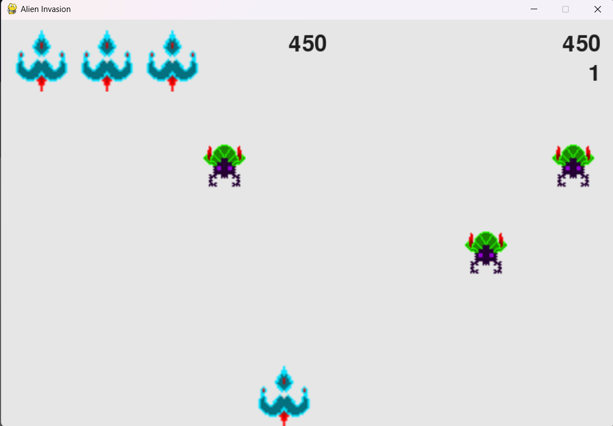

## Практическая работа №2: Базовая 2D-игра «Инопланетное вторжение» с использованием Pygame
#### Петелин И.А. ИВТ 2.1

### Цель работы:

Разработать игру «Инопланетное вторжение», в которой игрок управляет кораблём и должен уничтожить флот инопланетян. Работа позволит вам познакомиться с основами разработки игр на Python с помощью библиотеки pygame и
позволит применить эти знания о компьютерной графике, анимации и управлении событиями в дальнейшем.

### Результат выполненной работы:

## Выполненные задачи:
1. Настроенное окружение
2. Создано игровое окно
3. Разработан основной цикл игры
4. Создан класс Ship (Корабль)
5. Добавлена стрельба
6. Создание флота инопланетян
7. Добавлен конец игры и ограничения
8. Организована структура кода

## Доп задания:
9. Добавлена таблица рекордов
10. реализована система уровней и начисления очков